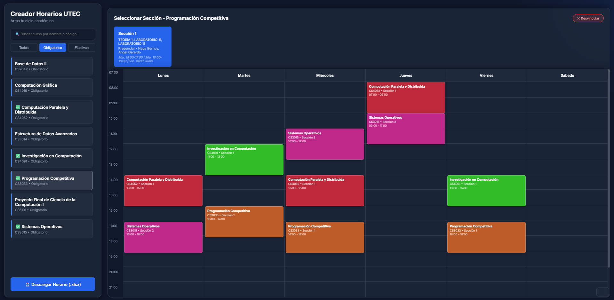
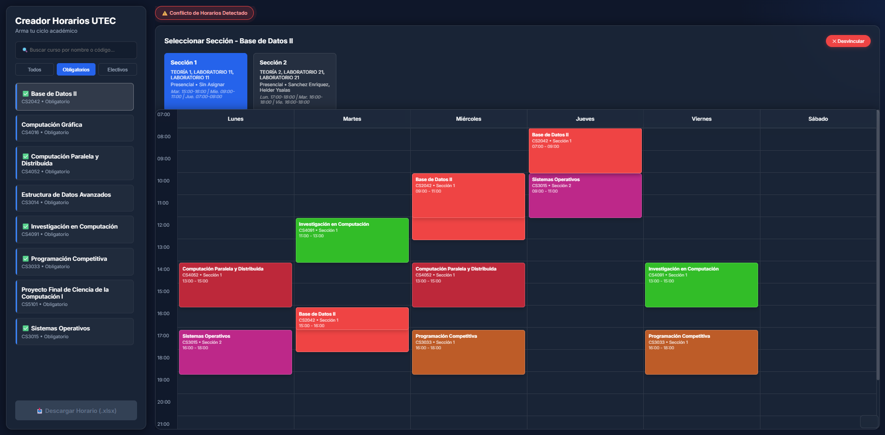
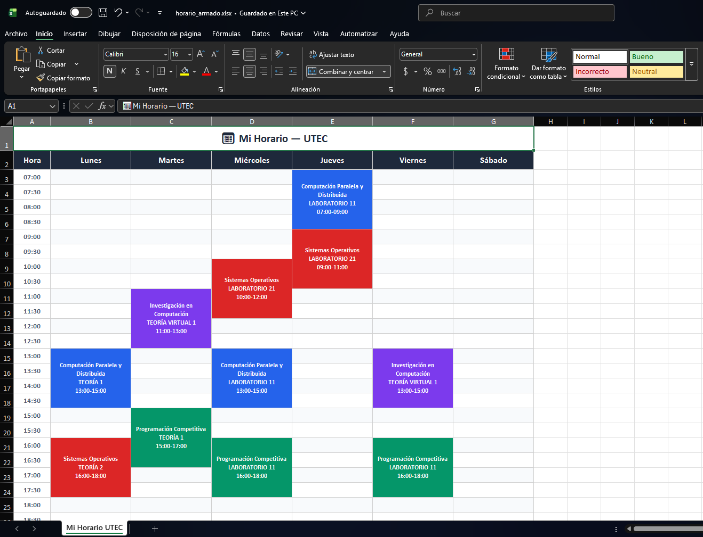

# 📅 Schedule Creator — UTEC

Aplicación web para armar y visualizar horarios académicos de la **Universidad de Tecnología e Ingeniería (UTEC)**. Permite seleccionar cursos y secciones de manera interactiva sobre una grilla de calendario semanal, detectar conflictos de horarios entre cursos y exportar el horario final a un archivo Excel (`.xlsx`).



---

## ✨ Funcionalidades

- **Búsqueda y filtrado** — Busca cursos por nombre o código, y filtra por tipo (Obligatorio / Electivo).
- **Selección de secciones agrupadas** — Las sesiones de teoría y laboratorio se agrupan lógicamente por número de sección para una selección más intuitiva.
- **Calendario visual interactivo** — Visualiza los bloques de horario sobre una grilla semanal (Lunes a Sábado, 07:00–23:00) con colores únicos por curso.
- **Detección de conflictos** — Identifica automáticamente solapamientos de horario entre cursos distintos y los resalta en rojo.
- **Exportación a Excel Inteligente** — Descarga el horario armado como archivo Excel (`.xlsx`) basándose **exclusivamente en las secciones seleccionadas** actualmente en el calendario. El archivo tiene formato de grilla semanal, colores por curso y bloques de horario detallados.
- **Soporte Docker** — Incluye `Dockerfile` para despliegue en contenedores.

---

## 🗂️ Estructura del Proyecto

```
Schedule_Creator_UTEC/
├── backend/
│   ├── app.py          # Servidor Flask (API REST + archivos estáticos)
│   ├── database.py     # Modelos SQLAlchemy (Course, Section, Schedule)
│   ├── parser.py       # Extracción de datos desde PDFs y población de la BD
│   └── app.db          # Base de datos SQLite pre-poblada (lista para usar)
├── static/
│   ├── index.html      # Interfaz principal
│   ├── css/style.css   # Estilos (glassmorphism, dark mode)
│   └── js/
│       ├── api.js      # Comunicación con la API del backend
│       ├── calendar.js # Lógica de conflictos y cálculos de posición
│       └── ui.js       # Renderizado del DOM e interactividad
├── Data/
│   └── Horario General.pdf  # PDF de horarios (fuente de datos)
├── Output/             # Archivos Excel generados (salida, no se commitea)
├── tests/
│   └── test_parser.py  # Tests unitarios con pytest
├── Dockerfile
├── requirements.txt
└── README.md
```

---

## 🛠️ Tecnologías

| Componente | Tecnología |
|---|---|
| Backend | Python 3.10+, Flask, Flask-SQLAlchemy |
| Base de datos | SQLite |
| Parsing de PDFs | pdfplumber, pandas |
| Frontend | HTML5, CSS3 (Vanilla), JavaScript (Vanilla) |
| Exportación | openpyxl (Excel) |
| Contenedores | Docker |
| Testing | pytest |

---

## 🚀 Cómo Ejecutar el Proyecto

### Requisitos Previos

- **Python 3.10+** instalado

> **Nota Importante:** El repositorio incluye una base de datos `backend/app.db` de prueba para que la app corra inmediatamente. Sin embargo, esta base clasifica los cursos (Obligatorio/Electivo) según el usuario original. **Para que la aplicación funcione con tu propia malla curricular**, debes repoblar la base de datos con tu archivo personal.

### Instalación y Ejecución por Terminal

1. **Clonar el repositorio:**

   ```bash
   git clone https://github.com/LuisIZ/Schedule-creator---UTEC.git
   cd Schedule-creator---UTEC
   ```

2. **Crear y activar un entorno virtual (recomendado):**

   ```bash
   # Windows
   python -m venv .venv
   .venv\Scripts\activate

   # macOS / Linux
   python3 -m venv .venv
   source .venv/bin/activate
   ```

3. **Instalar las dependencias:**

   ```bash
   pip install -r requirements.txt
   ```

4. **Iniciar el servidor:**

   ```bash
   python backend/app.py
   ```

5. **Abrir la aplicación** en el navegador:

   ```
   http://127.0.0.1:5000
   ```

### Ejecución con Docker

```bash
# Construir la imagen
docker build -t utec-schedule .

# Ejecutar el contenedor
docker run -p 5000:5000 utec-schedule
```

Luego abrir `http://127.0.0.1:5000` en el navegador.

---

## 🔄 Re-poblar la Base de Datos (Recomendado para Personalizar)

Para que los filtros y la clasificación de cursos funcionen para ti, debes actualizar los datos:

1. Coloca los archivos en la carpeta `Data/`:
   - `Horario General.pdf` — Horario general con todos los cursos y secciones (requerido)
   - `Horario Personal.pdf` — Horario personal con tus cursos matriculados (requerido para clasificar Obligatorio/Electivo)

2. Ejecuta el parser:

   ```bash
   python backend/parser.py
   ```

   Esto reemplazará la base de datos existente con los nuevos datos.

---

## 🧪 Ejecutar Tests

```bash
pytest tests/
```

---

## 📖 Uso de la Aplicación

### 1. Búsqueda y Selección de Cursos
- **Buscar cursos:** Usa la barra de búsqueda o los filtros (Todos / Obligatorios / Electivos) en el panel lateral.
- **Seleccionar una sección:** Haz clic en un curso para ver sus secciones agrupadas (teoría + laboratorio). Selecciona la sección deseada.
- **Visualizar en el calendario:** Los bloques de horario aparecerán automáticamente en la grilla semanal con un color único por curso.


### 2. Detección de Conflictos
- **Revisar conflictos:** Si hay solapamiento entre cursos diferentes, se mostrará un banner de alerta amarillo `⚠️ Conflicto de Horarios Detectado` y los bloques en conflicto se resaltarán en rojo.
- **Desvincular:** Si deseas quitar un curso del horario para resolver el conflicto, haz clic en el botón "✕ Desvincular" en el panel de detalles de la sección.


### 3. Exportar tu Horario
- Una vez satisfecho con el horario y sin conflictos pendientes, haz clic en el botón inferior izquierdo **"📥 Descargar Horario (.xlsx)"**.
- El navegador **descargará el archivo a tu equipo local automáticamente**. Además, el sistema guardará una copia de respaldo en la carpeta reservada `Output/` dentro del repositorio, la cual se ignora en Git para privacidad.
- El Excel formateado como horario semanal exportará de forma inteligente **solo las instancias de las secciones que elegiste**. 

